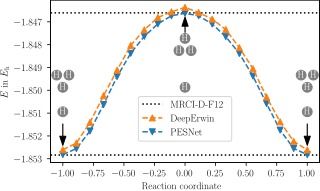
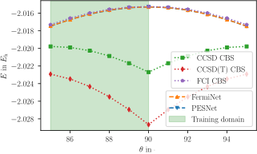
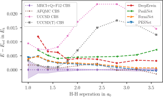
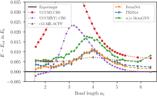
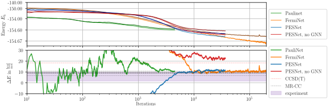

# Potential Energy Surface Network (PESNet)
Reference implementation of PESNet as proposed in

[Ab-Initio Potential Energy Surfaces by Pairing GNNs with Neural Wave Functions](https://www.daml.in.tum.de/pesnet) <br/>
by Nicholas Gao, Stephan Günnemann<br/>
published as Spotlight at ICLR 2022.

## Run the code
First install [JAX](https://github.com/google/jax) and the correct [CUDA Toolkit](https://anaconda.org/anaconda/cudatoolkit) and [CUDNN](https://anaconda.org/anaconda/cudnn), then this package via
```bash
pip install -e .
```
You can now train a model, e.g., H2, via a config file
```bash
python train.py with configs/systems/h2.yaml print_progress=True
```
You can overwrite parameters either via [CLI](https://sacred.readthedocs.io/en/stable/command_line.html) or via the config file.
All progress is tracked on tensorboard.

<b>Warning:</b> Multi-GPU training is experimental and may not behave correctly. To avoid issues, please set `CUDA_VISIBLE_DEVICES` if your system has multiple GPUs.

### Running multiple experiments
To run multiple experiments, we recommend to use the [`seml`](https://github.com/TUM-DAML/seml) library.
However, we also provide `YAML` files to train each system individually.


## Reproducing results from the paper
### H4+:
```bash
python train.py with configs/systems/h4plus.yaml print_progress=True
```

### Hydrogen rectangle:
```bash
python train.py with configs/systems/h4.yaml print_progress=True
```

### Hydrogen chain:
```bash
python train.py with configs/systems/h10.yaml print_progress=True
```

### Nitrogen molecule:
```bash
python train.py with configs/systems/n2.yaml print_progress=True pesnet.ferminet_params.determinants=32
```

### Cyclobutadiene:
```bash
python train.py with configs/systems/cyclobutadiene.yaml \
    print_progress=True \
    pesnet.ferminet_params.determinants=32 \
    pesnet.ferminet_params.hidden_dims='[[512, 32, True], [512, 32, True], [512, 32, True], [512, 32, True]]'
```


## Contact
Please contact [gaoni@in.tum.de](mailto:gaoni@in.tum.de) if you have any questions.


## Cite
Please cite our paper if you use our method or code in your own work:
```
@inproceedings{gao_pesnet_2022,
    title = {Ab-Initio Potential Energy Surfaces by Pairing GNNs with Neural Wave Functions},
    author = {Gao, Nicholas and G{\"u}nnemann, Stephan}
    booktitle = {International Conference on Learning Representations (ICLR)},
    year = {2022}
}
```

## License
Hippocratic License v2.1
